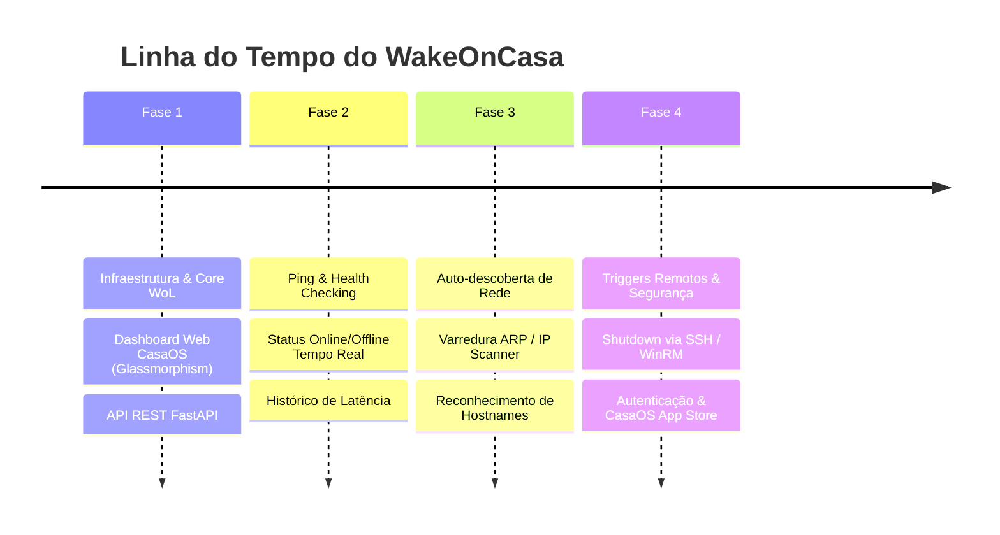

# WakeOnCasa - Roadmap de Desenvolvimento

Este documento descreve o plano de desenvolvimento do **WakeOnCasa**, estruturado em fases incrementais com o objetivo de entregar uma aplicação robusta, intuitiva e nativamente integrada ao CasaOS.

---

## 🎯 Visão Geral do Produto
O **WakeOnCasa** é uma ferramenta self-hosted para gerenciamento de energia de dispositivos em rede local (Wake-on-LAN + Ping Monitor + Remote Shutdown Triggers).

---

## 🚀 Fases do Roadmap

---

### 📌 Fase 1: Core Wake-on-LAN & Dashboard CasaOS (MVP)
> **Status**: 🟢 Em Implementação (Sprint Atual)

- [x] Leitura dos padrões de repositório e infraestrutura do servidor (`infos.md`).
- [x] Criação da documentação base (`resumo.md`, `ROADMAP.md`, `ARCHITECTURE.md`).
- [x] Organização da estrutura inicial de todo o projeto, criação do `README.md` e repositório no GitHub.
- [x] Criação do script de sincronização automatizada (`copiar-servidor.bat`).
- [x] Construção do backend Python (FastAPI):
  - Emissor de **Magic Packet UDP** (portas 7 e 9).
  - Persistência de lista de dispositivos em JSON (`/data/devices.json`).
  - Endpoints REST para listar, cadastrar, editar, excluir e acordar máquinas.
- [x] Interface Web Dashboard:
  - Estética **CasaOS Dark Glassmorphism** com cards visuais para cada dispositivo.
  - Exibição de Nome, Endereço IP, Endereço MAC, Ícone/Categoria e Ações Rápidas.
  - Animação de envio de sinal e confirmação visual ("Acordando...").
- [x] Empacotamento Docker & CasaOS:
  - `Dockerfile` enxuto otimizado para produção.
  - `docker-compose.yml` com especificações `x-casaos` e labels `com.casaos.app.*`.

---

### 📌 Fase 2: Monitoramento Contínuo de Latência & Status em Tempo Real
> **Status**: 🟢 Concluído (Sprint Atual)

- [x] Engine de verificação assíncrona por **Ping (ICMP/TCP)** em background no backend Python.
- [x] Atualização automática de status (Online / Offline / Standby) na UI sem necessidade de dar F5 (**Server-Sent Events - SSE**).
- [x] Medidor de latência (ping em ms) por dispositivo.
- [x] Notificações no navegador e **Webhooks** (Discord / Telegram / Custom HTTP) quando uma máquina for desligada ou religada.

---

### 📌 Fase 3: Descoberta Automática de Dispositivos na Rede
> **Status**: ⚪ Futuro

- [ ] Módulo de varredura de subnet (Network IP/ARP Scanner).
- [ ] Identificação automática de novos dispositivos conectados à rede local.
- [ ] Resolução de nome de host via mDNS/NetBIOS/Reverse DNS.
- [ ] Botão de "Adicionar Rápido" a partir da lista de dispositivos descobertos.

---

### 📌 Fase 4: Comandos Remotos (Shutdown/Sleep) & Segurança Avançada
> **Status**: ⚪ Futuro

- [ ] Execução remota de comandos de desligamento (**Remote Shutdown** / **Sleep**) via SSH (Linux) e WinRM / RPC (Windows).
- [ ] Sistema de perfis de energia por máquina (Horários programados para ligar/desligar automaticamente).
- [ ] Autenticação por PIN / Senha opcional no painel.
- [ ] Submissão do pacote da aplicação para a loja comunitária de aplicativos do CasaOS (CasaOS App Store format).

---

## 📊 Critérios de Sucesso
1. **Confiabilidade WoL**: Sucesso em 100% dos disparos de pacotes Magic Packet UDP broadcast na sub-rede local.
2. **Tempo de Resposta**: Interface respondendo em menos de 50ms para interações locais.
3. **Padrão CasaOS**: Instalação perfeita com 1 clique usando o `docker-compose.yml` gerado.
